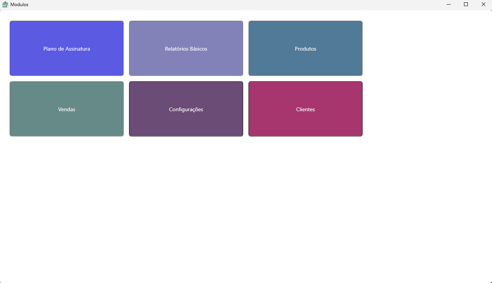
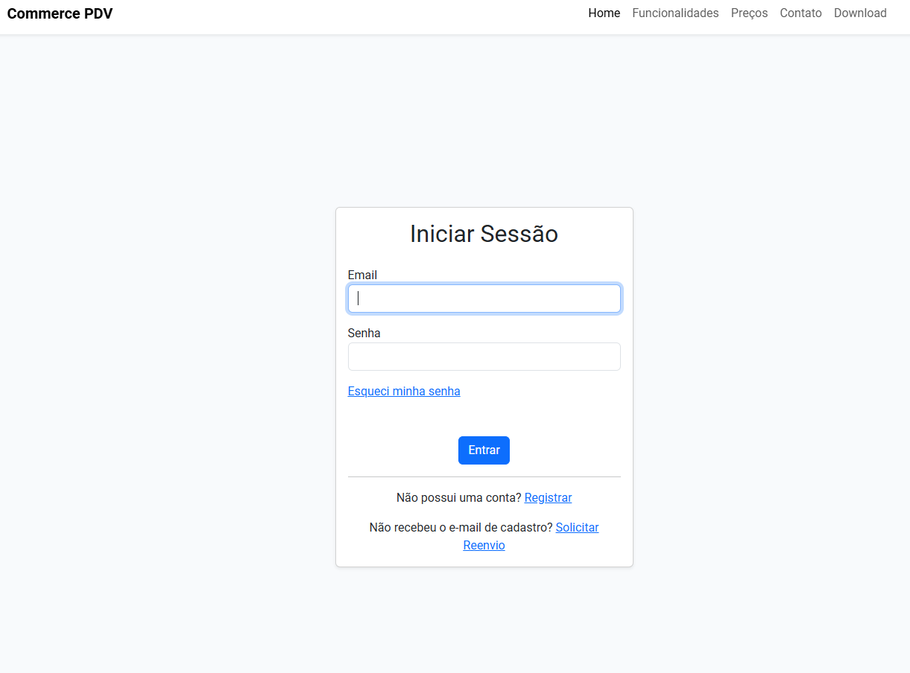
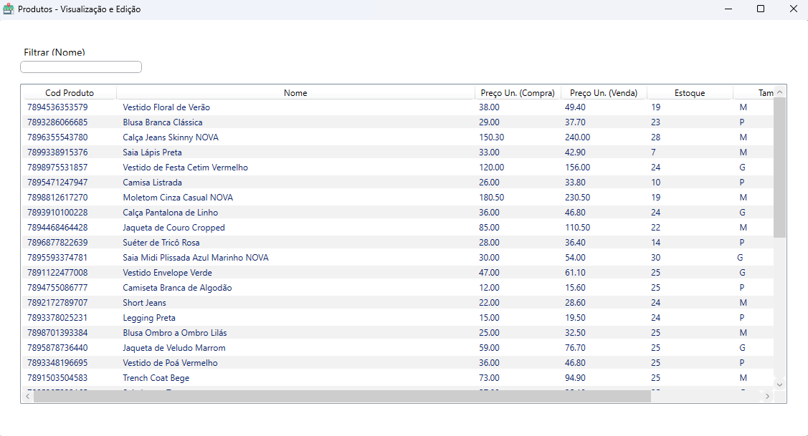
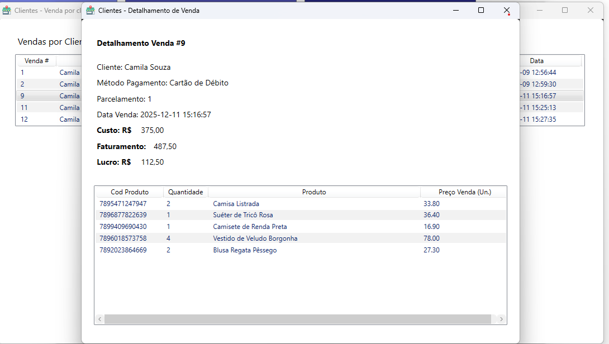
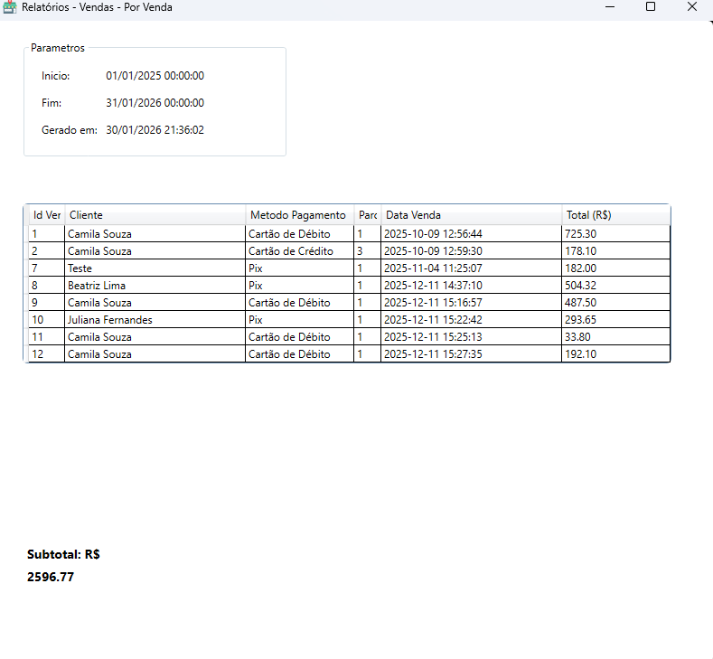
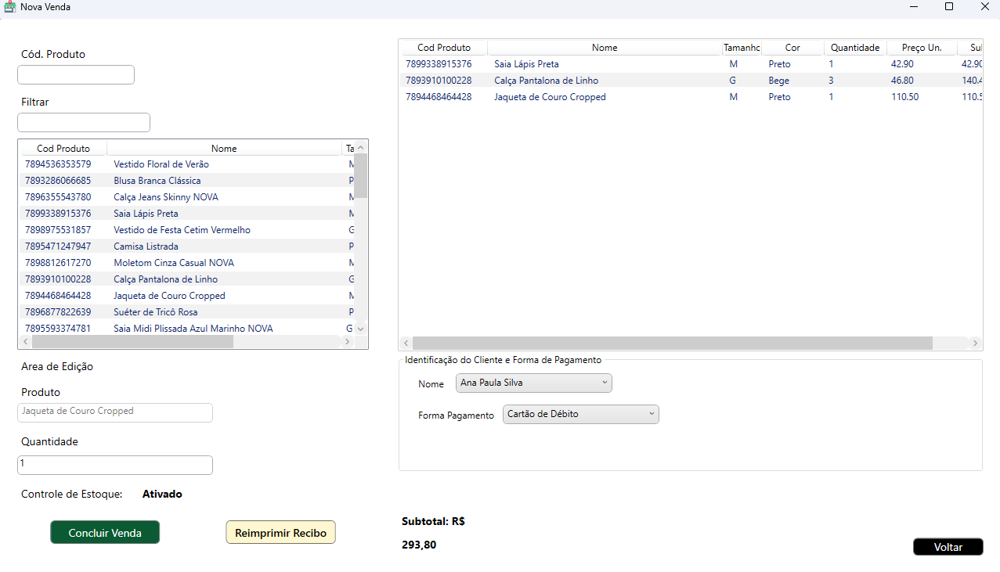

# Commerce PDV - Complete Point of Sale Ecosystem

> **A professional, full-stack Point of Sale system showcasing multi-tenant architecture, cloud synchronization, and enterprise-grade security**

[](https://www.php.net/)
[](https://symfony.com/)
[](https://docs.microsoft.com/en-us/dotnet/csharp/)
[](https://dotnet.microsoft.com/)
[](https://www.mysql.com/)
[](https://www.postgresql.org/)

**Commerce PDV** is a complete, production-ready Point of Sale ecosystem designed for retail stores and small businesses. Built with modern technologies and enterprise-grade architecture, it demonstrates advanced full-stack development capabilities including multi-tenant systems and secure cloud synchronization.

---

## 📋 Overview

**Commerce PDV** is a comprehensive business management solution that combines:

- **Modern web portal** for user management and administration
- **Powerful REST API** with multi-tenant architecture
- **Feature-rich desktop application** for point-of-sale operations

### What is Commerce PDV?

Commerce PDV is a complete ecosystem for managing sales, inventory, and customer relationships. It's designed to help businesses of all sizes process transactions efficiently, manage inventory in real-time, and gain insights through powerful reporting tools.

### Target Audience

- **Retail Stores**: Manage products, process sales, track inventory
- **Small Businesses**: Start free, scale as you grow
- **Restaurants**: Order management and kitchen integration (planned - to be implemented)
- **Multi-location Businesses**: Centralized cloud management

### Key Value Propositions

✅ **Multi-Tenant**: Secure, isolated data for each customer  
✅ **Cloud Sync**: Automatic synchronization across all devices  
✅ **Scalable**: From single store to enterprise deployments  
✅ **Secure**: Enterprise-grade security with HMAC signatures, rate limiting, and AES-256 encryption  
✅ **Modern Stack**: Built with latest technologies and best practices  

### Why This Project Matters

This project showcases the ability to architect and implement a complete business solution from the ground up, addressing real-world challenges like:

- Building scalable multi-tenant systems
- Designing secure authentication across multiple platforms
- Creating seamless integration between web and desktop applications
- Managing complex data synchronization scenarios
- Implementing enterprise-grade security with HMAC signatures and rate limiting

---

## 🏗️ System Architecture

The Commerce PDV ecosystem consists of three main components that work together seamlessly:

```
┌─────────────────────────────────────────────────────┐
│                   End Users                         │
└──────────┬──────────────────────┬───────────────────┘
           │                      │
    ┌──────▼──────┐        ┌─────▼─────────────┐
    │ CommerceWeb │        │  CommerceApp      │
    │  (Portal)   │        │  (Desktop POS)    │
    │             │        │                   │
    │ - Admin     │        │ - Sales           │
    │ - Users     │        │ - Inventory       │
    │             │        │ - Clients         │  
    │             │        │ - Reports         │  
    │             │        │ - Custom Settings │  
    └──────┬──────┘        └──────┬────────────┘
           │                      │
           │    HTTPS/REST API    │
           └──────────┬───────────┘
                      │
            ┌─────────▼──────────┐
            │   CommerceApi      │
            │   (Backend)        │
            │                    │
            │ - Authentication   │
            │ - Business Logic   │
            │ - Multi-tenant     │
            └─────────┬──────────┘
                      │
            ┌─────────▼──────────┐
            │   MySQL/PostgreSQL │
            │   (Databases)      │
            └────────────────────┘
```

---

## 🎯 Ecosystem Components

| Component | Technology Stack | Description | Key Features |
|-----------|-----------------|-------------|--------------|
| **CommerceWebsite** | PHP, Symfony 7.2, PostgreSQL, Bootstrap 5 | Marketing and user management portal | User registration, email verification, subscription plans, download center, multi-tenant setup |
| **CommerceApi** | PHP 7.4+, MySQL, REST | Backend API with multi-tenant architecture | HTTP Basic Auth, product/sales/client management, reports, plan-based feature gating, maintenance mode |
| **CommerceApp** | C# 12, .NET 8.0, WPF, XAML | Windows desktop POS application | Sales processing, inventory control, offline mode, receipt printing, cloud sync |

---

## ✨ Key Features by Component

### CommerceWebsite (Portal)

- 🌐 **Modern responsive landing page** with professional design
- 👤 **Secure user registration** with email verification workflow
- 💳 **Three-tier subscription system** (Starter, Basic, Premium)
- 📥 **Desktop application download center** with version management
- 📧 **Contact form** with intelligent rate limiting
- 🔐 **Multi-tenant architecture** with isolated database provisioning
- 🔒 **AES-256-GCM email encryption** for sensitive data
- 📜 **Terms of Service and Privacy Policy** pages
- 🎨 **Bootstrap 5** modern UI components
- ⚡ **Hotwired Stimulus** for reactive interactions
- 🌐 **Link** https://raulpellizzer.com/

### CommerceApi (Backend)

- 🏢 **Multi-tenant database architecture** with dynamic tenant selection
- 🔐 **HTTP Basic Authentication** with bcrypt password hashing
- 📦 **Full CRUD operations** for Products, Clients, and Sales
- 📊 **Dynamic report generation** with flexible date ranges
- 🎯 **Plan-based feature gating system** enforcing subscription limits
- 🔧 **Maintenance mode** with debug key override capability
- 📝 **Comprehensive logging system** for debugging and auditing
- 🔒 **Client Authentication (HMAC-SHA256)**: Cryptographic request signing with API key/secret for tamper-proof API access
- ⏱️ **Rate Limiting**: 60 requests/minute, 1000 requests/hour per client with configurable limits
- 📊 **Request Audit Logging**: Complete tracking of all API requests with signature validation status
- 🛡️ **Replay Attack Prevention**: Timestamp validation within ±5 minute window
- 🔐 **Multi-layer Authentication**: Client authentication (HMAC) + User authentication (Basic Auth)
- ⚙️ **Configuration API endpoints** for client applications
- 💊 **Health check monitoring** for system status
- 🛡️ **SQL injection prevention** with prepared statements
- 🔄 **RESTful API design** following best practices

### CommerceApp (Desktop)

- 💰 **Fast sales processing** with barcode scanning support
- 📦 **Real-time inventory management**
- 👥 **Customer database** with complete purchase history
- 📊 **Sales reports and analytics** with custom date ranges
- 🖨️ **Thermal receipt printing**
- 💳 **Multiple payment methods** support (cash, credit, debit) - Not integrated with card providers
- ☁️ **Automatic cloud synchronization** with conflict resolution
- 🔐 **Encrypted local data storage** for security
- 🔐 **HMAC Request Signing**: Automatic cryptographic signing of all API requests
- 🔑 **Secure Credential Storage**: API key/secret configuration management
- 🛡️ **Request Integrity**: Tamper-proof communication with backend API
- 🎨 **Modern WPF interface** with MVVM architecture

---

## 🔄 Integration Flow

### Complete User Journey

```
User Journey:
1. User visits CommerceWebsite
2. Registers account (stored in MySql)
3. An email is sent to create tenant DB and initial setup
4. User receives verification email
5. User downloads CommerceApp installer
6. User installs desktop application
7. User logs in (authenticated via CommerceApi)
8. CommerceApp syncs data with CommerceApi
9. User processes sales
10. Data automatically syncs to cloud via CommerceApi
11. User views reports on CommerceApp or CommerceWebsite
```

### Data Flow

```
┌──────────────┐
│ CommerceApp  │
└──────┬───────┘
       │ Sync Request
       ▼
┌──────────────┐
│ CommerceApi  │
│ (REST API)   │
└──────┬───────┘
       │ Query/Update
       ▼
┌──────────────┐
│ MySQL        │
│ (Tenant DB)  │
└──────────────┘
```

---

## 🛠️ Technology Stack

| Layer | Technologies |
|-------|-------------|
| **Frontend (Web)** | Symfony 7.2, Twig, Bootstrap 5, Stimulus (Hotwired), JavaScript |
| **Frontend (Desktop)** | WPF, XAML, C# 12, .NET 8.0 |
| **Backend** | PHP 7.4+, Vanilla PHP (no framework for API) |
| **Databases** | MySQL 8.0+ (API), PostgreSQL 14+ (Website) |
| **Authentication** | HTTP Basic Auth, Bcrypt, JWT (planned) |
| **APIs** | RESTful API, JSON |
| **DevOps** | Docker Compose, Git, Composer, NuGet |
| **Security** | AES-256-GCM encryption, HTTPS/TLS, CSRF protection, Rate limiting |
| **Architecture** | Three-tier, Multi-tenant, MVVM (desktop), MVC (web/api) |

---

## 🎨 Architecture Patterns

### Multi-Tenant Architecture

**Each customer gets complete isolation:**

- ✅ Dedicated database per tenant
- ✅ Tenant identified through authentication
- ✅ Complete data isolation and security
- ✅ Scalable to thousands of tenants
- ✅ Independent schema versioning per tenant

**Benefits:**
- Maximum data security
- Customer-specific customizations
- Easy backup and recovery per tenant
- Compliance with data regulations

### MVVM (Model-View-ViewModel) - CommerceApp

**Clean architecture for desktop application:**

- ✅ Separation of UI and business logic
- ✅ Testable code without UI dependencies
- ✅ Two-way data binding
- ✅ Command pattern for user actions
- ✅ Observable collections for reactive UI

**Benefits:**
- Maintainable codebase
- Unit testable business logic
- Reusable view models
- Designer-developer collaboration

### MVC (Model-View-Controller) - CommerceWebsite & CommerceApi

**Traditional web architecture:**

- ✅ Clear separation of concerns
- ✅ RESTful API design
- ✅ Prepared statements for security
- ✅ Middleware pipeline
- ✅ Dependency injection

**Benefits:**
- Proven pattern
- Framework support (Symfony)
- Easy to understand and maintain
- Scalable and testable

---

## 🔐 Security Features

### Authentication & Authorization

- 🔐 **HTTP Basic Authentication** for API requests (JWT planned for future releases)
- 🔑 **Bcrypt password hashing** with work factor (xx) (hidden for security reasons)
- ✉️ **Email verification** for new registrations
- 🚫 **Rate limiting** on sensitive endpoints
- 🔄 **JWT tokens** (planned for enhanced security)

### Encryption & Data Protection

- 🔒 **AES-256-GCM encryption** for sensitive email data
- 🔐 **TLS/HTTPS** for all API communications
- 🔑 **Secure key management** with environment variables
- 🛡️ **SQL injection prevention** via prepared statements
- 🧹 **Input sanitization** and validation

### Access Control

- 🏢 **Multi-tenant data isolation** at database level
- 📊 **Plan-based feature gating** system
- 🔐 **Role-based permissions** (planned)
- 🚫 **CSRF protection** on web forms
- 📝 **Comprehensive audit logging**

### Audit & Compliance

- 📋 **Transaction audit trails** for all operations
- 👤 **User activity tracking** and logging
- 🔍 **Error monitoring** and alerting
- 📊 **Security event logging**
- 🔄 **Data retention policies**

---

## 💼 Use Cases

### 🏪 Retail Store

**Scenario**: Small to medium retail business

- ✅ Process sales quickly with barcode scanning
- ✅ Track inventory in real-time with automatic alerts
- ✅ Generate end-of-day sales reports
- ✅ Manage customer database and loyalty programs
- ✅ Handle returns and exchanges efficiently
- ✅ Multi-register support for peak hours

**Benefits**: Reduced checkout time, accurate inventory, better customer insights

---

### 🏢 Small Business

**Scenario**: Growing business needing scalable solution

- ✅ **Starter Plan**: Begin for free with essential features
- ✅ **Growth**: Upgrade seamlessly as business expands
- ✅ **Multi-location**: Centralized management (planned)
- ✅ **Cloud Backup**: Automatic data protection
- ✅ **Reporting**: Business intelligence and insights
- ✅ **Support**: Technical assistance and updates

**Benefits**: Low initial investment, pay-as-you-grow, professional solution

---

## 🚀 Getting Started

### For End Users

**Quick Start Guide:**

1. 🌐 Visit the **Commerce PDV website**
2. 📝 **Register** for a new account
3. ✉️ **Verify** your email address
4. ✉️ **Setup** Wait for initial setup from admin - We will be in touch!
4. 💳 **Choose** a subscription plan (Free Starter available)
5. 📥 **Download** the desktop application installer
6. 💻 **Install** CommerceApp on your Windows PC
7. 🔐 **Login** with your credentials
8. 🎉 **Start processing sales!**

---

### For Developers

**Architecture Overview:**

Each component has its own setup process with detailed documentation.

**Prerequisites:**
- PHP 7.4+ with Composer (for API and Website)
- .NET 8.0 SDK (for Desktop App)
- MySQL 8.0+ and PostgreSQL 14+
- Docker & Docker Compose (recommended)

**Note**: Individual component repositories are private. See [Repository Links](#-repository-links) section.

---

## 📊 Project Statistics

| Metric | Value |
|--------|-------|
| **Total Lines of Code** | ~50,000+ |
| **Development Time** | 8+ months |
| **Major Components** | 3 applications |
| **Programming Languages** | C#, PHP, JavaScript, SQL |
| **Databases** | MySQL, PostgreSQL |
| **Architecture Style** | Multi-tenant |
| **Supported Platforms** | Windows (Desktop), Web (Cross-platform) |
| **API Endpoints** | 30+ RESTful endpoints |
| **Database Tables** | 50+ across all components |

---

## 🔗 Repository Links

⚠️ **Important Note**: The individual component repositories are **private** and contain proprietary code. This repository serves as a **portfolio showcase** only.

**Contact Information**: For access inquiries or demos, please reach out via email at CommercePDV@raulpellizzer.com

---

## 📸 Screenshots

**🏠Landing Page**


**💻 CommerceApp main dashboard**


**📝 User registration and subscription flow**


**📦 Inventory management screen**


**📊 Sales By Client**


**📊 Sales**


**📊 Sales Window**


---

## 💡 Technical Highlights

### Complex Problems Solved

**1. Multi-Tenant Database Architecture**
- Dynamic tenant selection based on authentication
- Connection pool optimization for scalability

**2. Real-Time Data Synchronization**
- Bidirectional sync between desktop and cloud
- Change tracking and delta updates
- Optimistic locking for concurrent updates
- Background sync with minimal user interruption

**3. Plan-Based Feature Gating**
- Dynamic feature access based on subscription tier
- Graceful degradation when limits reached
- Usage tracking and quota enforcement
- Upgrade prompts and seamless plan migration

**4. Email Encryption with Search**
- AES-256-GCM encryption for email addresses
- Searchable hash index for lookups
- Key rotation support
- GDPR compliance ready

**5. Secure Cross-Platform Authentication**
- Single authentication source (API)
- Secure credential storage on desktop

**7. Scalable REST API**
- Prepared statements preventing SQL injection
- Efficient query optimization
- Response caching strategies
- Rate limiting and DDoS protection (To be reviewed)

---

### Best Practices Implemented

**Software Engineering:**
- ✅ **SOLID Principles** - Single responsibility, Open/closed, Liskov substitution, Interface segregation, Dependency inversion
- ✅ **Design Patterns** - MVVM, MVC, Factory, Repository, Observer, Command
- ✅ **Dependency Injection** - Loose coupling and testability
- ✅ **Clean Code** - Meaningful names, small functions, clear intent

**Architecture:**
- ✅ **RESTful API Design** - Resource-based URLs, proper HTTP methods, status codes
- ✅ **Database Normalization** - 3NF normalized schemas
- ✅ **Separation of Concerns** - Clear layer boundaries
- ✅ **Scalability** - Horizontal scaling capability

**Security:**
- ✅ **Security-First Development** - Threat modeling and secure design
- ✅ **Defense in Depth** - Multiple security layers
- ✅ **Least Privilege** - Minimal access rights
- ✅ **Input Validation** - Whitelist approach

**Quality:**
- ✅ **Error Handling** - Comprehensive exception management
- ✅ **Logging** - Structured logging for debugging
- ✅ **Code Reviews** - Quality assurance processes
- ✅ **Documentation** - Inline comments and external docs

---

## 👨‍💻 Developer

**Raul Pellizzer**

Full-stack software developer specialized in building scalable, secure business solutions. Passionate about clean architecture, modern technologies, and solving complex technical challenges.

### Expertise

- **Backend**: PHP, C#, .NET, Node.js
- **Frontend**: WPF, Symfony, Bootstrap, JavaScript
- **Databases**: MySQL, PostgreSQL
- **Architecture**: Multi-tenant, RESTful APIs
- **DevOps**: Docker, CI/CD, Linux server administration

### Contact

- 📧 **Email**: CommercePDV@raulpellizzer.com
- 📧 **Personal Email**: raul1.pellizzer1@gmail.com
- 🐙 **GitHub**: [@raulpellizzer](https://github.com/raulpellizzer)
- 🐙 **LinkedIn**: https://www.linkedin.com/in/raul-pellizzer-2297971b0/
- 💼 **Portfolio**: This repository and others on GitHub

**Open to opportunities** in full-stack development, software architecture, and technical leadership roles.

---

## 📝 License

**Proprietary Software** - All Rights Reserved

© 2024-2026 Raul Dubbelt Pellizzer LTDA

This is a proprietary system developed for commercial purposes. The individual components (CommerceWebsite, CommerceApi, CommerceApp) are **private** and **not open source**.

**This repository** serves as a **portfolio showcase only** and does not contain the actual source code.

### Usage Restrictions

- ❌ No unauthorized copying or distribution
- ❌ No reverse engineering
- ❌ No commercial use without license
- ✅ Portfolio viewing and reference allowed
- ✅ Contact for licensing inquiries

---

## 🎯 Project Goals

### Completed Objectives ✅

- ✅ **Build a complete, production-ready POS system** from scratch
- ✅ **Demonstrate full-stack development capabilities** across multiple platforms
- ✅ **Implement enterprise-grade security** with encryption and authentication
- ✅ **Create scalable multi-tenant architecture** supporting hundreds of customers
- ✅ **Provide excellent user experience** with modern, intuitive interfaces
- ✅ **Solve complex technical challenges** (multi-tenancy, security, high performance software)

### Ongoing Objectives 🔄

- 🔄 **Offline Mode** for work without internet connection - auto sync whenever possible
- 🔄 **Continuously improve and add features** based on user feedback
- 🔄 **Maintain high code quality** with refactoring and optimization
- 🔄 **Expand platform support** (mobile, web improvements)
- 🔄 **Build a sustainable business** around the product

### Future Vision 🎯

- 🎯 **Help small businesses succeed** with affordable, powerful tools
- 🎯 **Foster a community** of users and developers
- 🎯 **Contribute to open source** where applicable
- 🎯 **Scale to enterprise** customers with advanced needs

---

<div align="center">

**⭐ If you find this project interesting, please star this repository! ⭐**

Built with ❤️ by [Raul Pellizzer](https://github.com/raulpellizzer)

</div>
